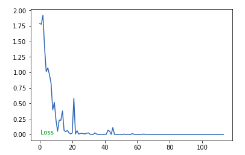

# Finger Detection using Pytorch
We use the Convolutional Neural Network model to identify the number of fingers  :hand: shown from the photograph.

Refrence:[Pytorch](https://pytorch.org/)
<br/>
## Requirements

	 1. Pytorch
	 2. torchsummary
	 3. Pygame
	 4. Opencv

<br/>

## Usage

### Prepare Training Dataset 
Create folder named ``data`` . Then create folders according to your class-label names(n folders for n classes).Then place all images into the corresponding folder(class-label).

To capture images run ``python data_collection.py`` specify the correct folder to the classes accordingly.
Then, run ``mask.py`` to achieve binary mask that is defined by grayscaling and blurring the image.

###### Folder structure

```
Root
│
├── data
│    ├── train
│    │     ├── ONE
│    │     │    ├── ONE_0.png 
│    │	   │	├── ONE_1.png
│    │	   │	└── ...
│    │	   ├── TWO
│    │     │    │    
│    │	   │	├── TWO_0.png
│    │	   │	└── TWO_1.png
│    │	   ├──	.
│    │	   └── 	.
│    │				
│    │     
│    └── test  (model)
│          ├── ONE
│          │    ├── ONE_0.png 
│    	   │	├── ONE_1.png
│    	   │	└── ...
│    	   ├── TWO
│          │    ├── TWO_0.png 
│    	   │	└── ...
│    	   │	
│    	   └──	FIVE
│    	    	│
│               ├── FIVE_0.png
│               └── ...
│
│
├── Finger Recognition.ipynb
└── model_chk.pt 
```
 
> Larger the number and variation in images, larger the accuracy of classification.

### Convolution Neural Net
```javascript
----------------------------------------------------------------
        Layer (type)               Output Shape         Param #
================================================================
            Conv2d-1           [-1, 32, 66, 66]             896
              ReLU-2           [-1, 32, 66, 66]               0
         MaxPool2d-3           [-1, 32, 33, 33]               0
            Conv2d-4           [-1, 64, 35, 35]           18496
              ReLU-5           [-1, 64, 35, 35]               0
         MaxPool2d-6           [-1, 64, 17, 17]               0
            Conv2d-7          [-1, 128, 19, 19]           73856
              ReLU-8          [-1, 128, 19, 19]               0
         MaxPool2d-9            [-1, 128, 9, 9]               0
           Linear-10                    [-1, 6]           62214
================================================================
Total params: 155462
Trainable params: 155462
Non-trainable params: 0
----------------------------------------------------------------
```
### Training 

Run the ``Finger Recognition.ipynb`` jupyter notebook to start the Training.

Once the training is completed the result is stored the main folder as ``model_chk.pt``

### Testing and Performance:

Average accuracy on the test set is 97.28448438289819

###### Loss


###### Output


#### ToDo
- [x] Train.
- [x] Test.
- [x] Predict.
- [x] Save/Load checkpoint.
- [ ] UI for input, output and to download checkpoint.


